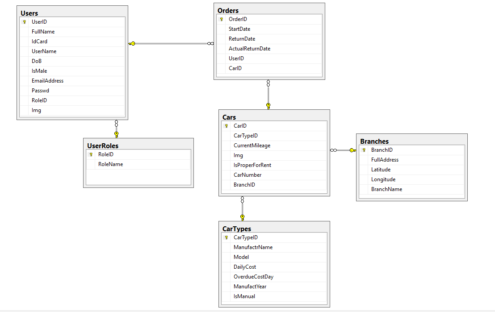
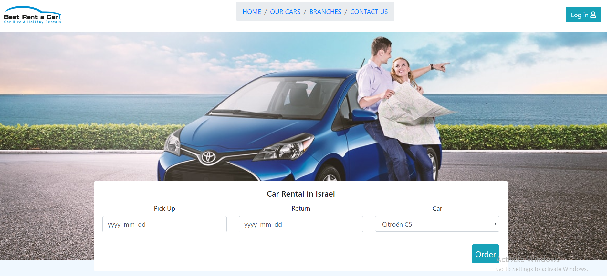
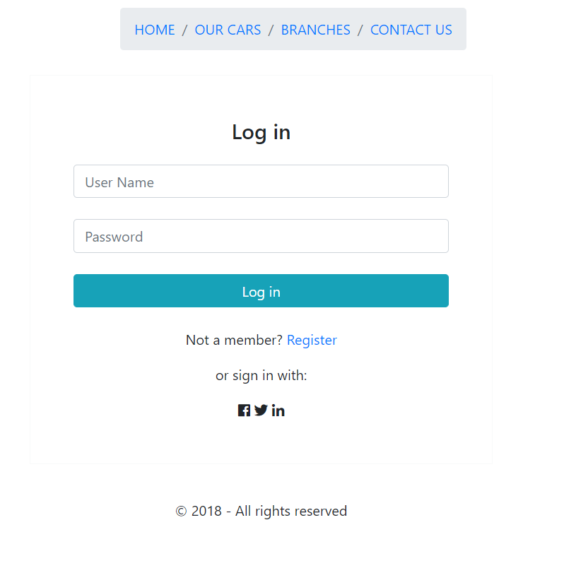
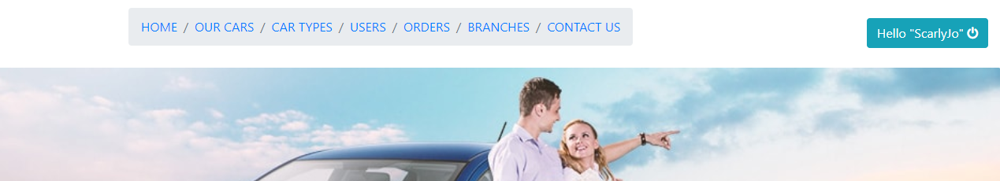
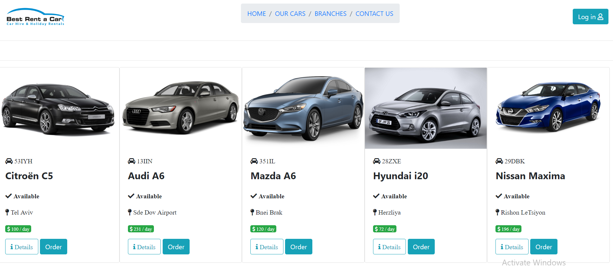
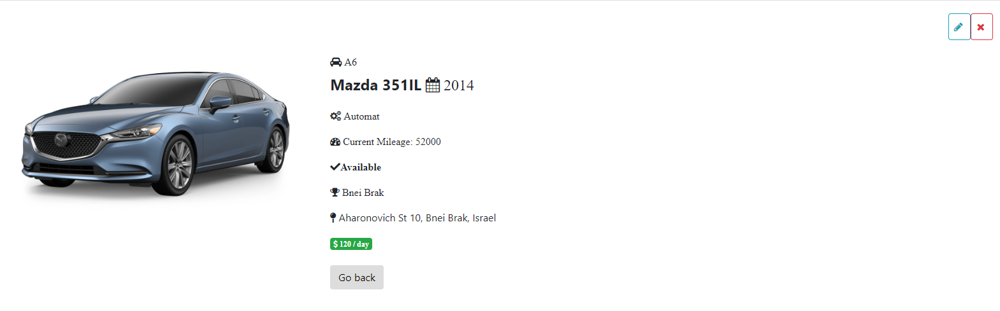
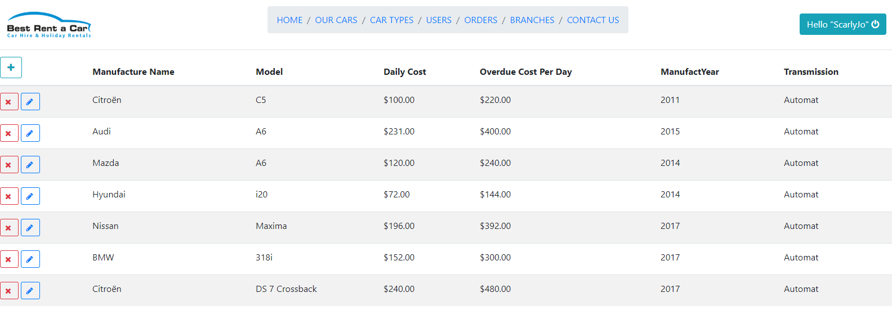
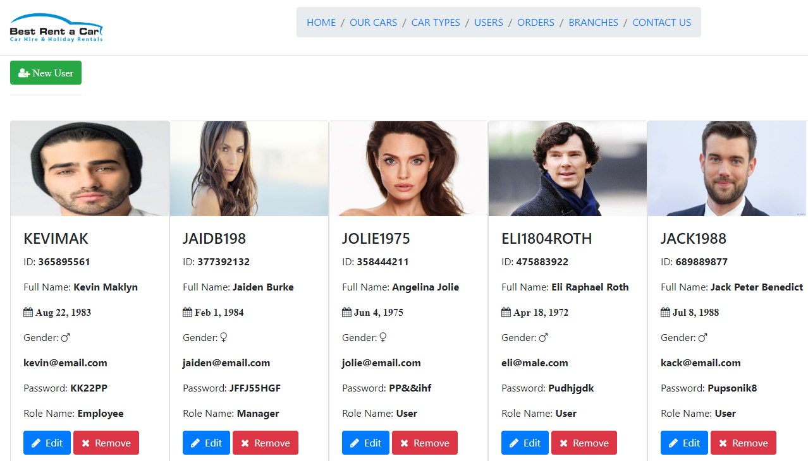
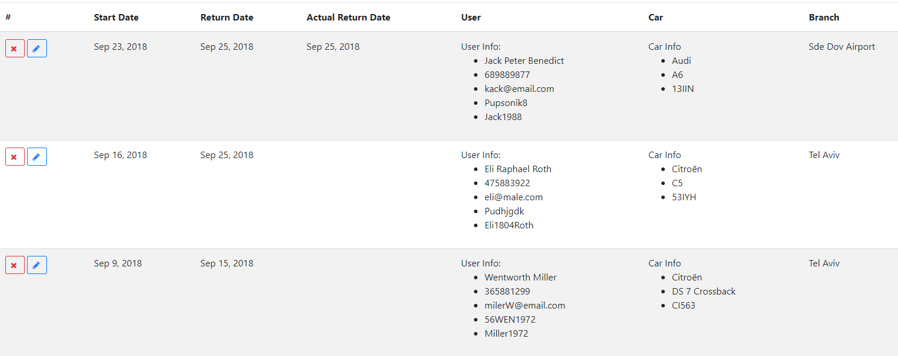
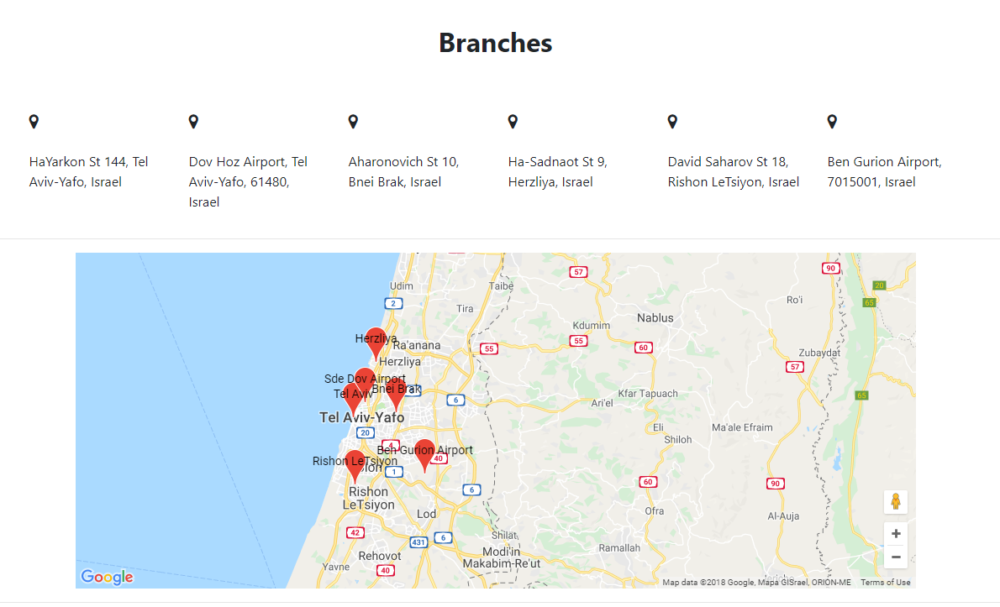

# Final-Project-Car-Rent
## This is my final project during the training period
----
### Subjects:

  - Database
  - Entity Framework
  - N-Tier Model
  - Web Api
  - Angular 5
  
  #### Programming language: C#, TypeScript
   
  

  # The project contains server and client sides
 ----

 ## Server Side

1. SQL Database 

 
2. N-TIER Model
   * DAL (Data Access Layer)
   * BOL (Business Object Layer)
   * BLL (Business Logic Layer)
   * UIL (Web API)
   
3. Web API
   * GET
   * PUT
   * POST
   * DELETE

## Client side
  
  1. Home page 

  
   
2. Login 

  
   

3. Home page after logged in

  
   

4. Cars

  
   

5. Car Details with edit/delete option

  
   

6. Car Types with the CRUD methods

  
   

7. Users with the CRUD methods

  
   

8. Orders

  
   

9. Branches

